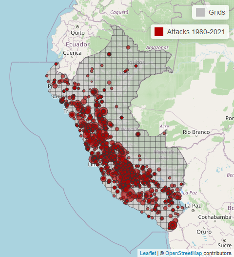

# Exploring terrorism in Peru: A spatial approach

This repository contains the Rmd file, datasets and shapefiles used in the master's thesis "Exploring terrorism in Peru: A spatial approach", by G. Carolina Cornejo Castellano as part of the Master in Computational Social Sciences (MUCSS), 2022- 2023, at the Universidad Carlos III de Madrid.

## Abstract
> The present thesis investigates the spatial diffusion of terrorist attacks in Peru during three temporalities: the peak of violence (1980-2000), its decline (2000-2021), and the entire period (1980-2021). To study the relationships between the occurrence of terrorist attacks and geographic features, three grid-cell level datasets are constructed with which Moran's _I_ tests and different spatial (spatial error and spatial autoregressive) and non-spatial (linear and negative binomial) models were applied. The findings reveal that spatial autocorrelation of attacks is more pronounced during the decline period. Moreover, the effects of certain spatial variables on the number of terrorist attacks vary across time periods and models, sometimes even reversing their impact.
 

  

## Usage
Clone the repository in your local drive. Then, set it as the workspace. As part of the Rmd code, the `.zip` files that contain the datasets and shapefiles will be extracted. Besides, the code itself will install the necessary packages that are not already installed.

## Files
The `/data/data.zip` folder contains the following files:
- `gtd_1970_2020.csv`, part of the Global Terrorism Database (University of Maryland, n.d.) with information on terrorist attacks around the world up to the year 2020.
- `gtd_ene_jun_2021.csv`, part of the Global Terrorism Database (University of Maryland, n.d.) with information on terrorist attacks around the world from 2020 to mid-2021.
- `prio.csv`, dataset with geodemographic variables specified at the 0.5 x 05 degree grid level (PRIO-GRID, n.d.)
- `xSub_GED_PER_priogrid_year.csv`, dataset with geodemographic variables compatibles with PRIO-GRID cells (University of Michigan, n.d.)

The `shapefiles/` folder contains subfolders with the shapefiles of grids cells worldwide and the external boundaries of Peru.

The `figs/` folder contains self-made figures that served to complement the thesis in .pdf.

## Data sources
PRIO-GRID. (n.d.). Retrieved June 17, 2023, from http://grid.prio.org

University of Maryland, U. (n.d.). Overview of the GTD. Retrieved January 15, 2023, from https://www.start.umd.edu/gtd

University of Michigan, U.-M. (n.d.). xSub. Retrieved June 19, 2023, from https://cross-sub.org/

Please, review the .pdf thesis to find the remaining references.

